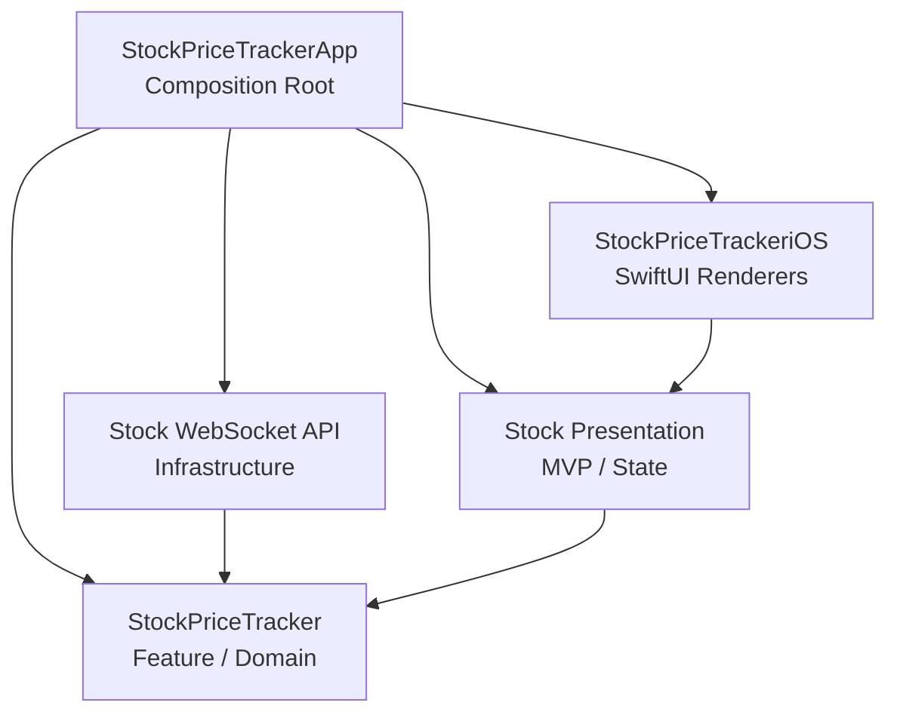

# Stock Price Tracker

A production-ready iOS application built to track real-time stock prices. It is built strictly adhering to Clean Architecture principles, the Model-View-Presenter (MVP) pattern, and test-driven development, mirroring the architectural blueprints of the *Essential Feed* case study but utilizing modern SwiftUI for the presentation rendering.

## Architecture

The project is structured into two main workspaces to strictly separate business logic from composition:

1. **`StockPriceTracker.fw` (Business Logic Framework)**: Contains the pure Domain, API infrastructure, and agnostic Presentation layers (Presenters & ViewModels). It has zero dependencies on SwiftUI or UIKit (except in the UI-specific module).
2. **`StockPriceTrackerApp` (Composition Root)**: Contains the true `@main` entry point. It instantiates the API clients, connects them to the Presenters using Adapters and `WeakRefVirtualProxy` objects, and returns the composed SwiftUI Views.

## Layers & Components

- **Domain**: Pure `Stock` entity and `StockFeedLoader` protocols. All async logic operates over `AsyncThrowingStream` for robust concurrency.
- **API**: A `WebSocketClient` abstraction with concrete `URLSessionWebSocketClient` using Postman Echo to simulate incoming real-time socket data.
- **Presentation**: Generic `LoadResourcePresenter` handles loading and error states, while `StockPresenter` handles formatting prices and sorting logic entirely independent of UI frameworks.
- **SwiftUI Integration**: Presenter protocols (like `ResourceView`) are fulfilled by App-level Adapters that hydrate `@StateObject` wrappers, bridging agnostic architecture into reactive UI seamlessly. Memory retain cycles are naturally mitigated using `WeakRefVirtualProxy`.

## Built With

- **Swift 5.10 / iOS 17+**
- **SwiftUI** & **NavigationStack**
- **Structured Concurrency** (`async/await`, `TaskGroups`, `AsyncStream`)
- **TDD** (Dependency injection & Protocol-driven abstractions)

## Testing

The project uses pure unit tests decoupled from SDKs like `URLProtocol` when web sockets are involved (spy techniques). To run the tests, select either the framework scheme targeting macOS (for instant headless testing) or the App scheme targeting the iOS Simulator.

## Running the App

1. Open `StockPriceTracker.xcworkspace`.
2. Select the **StockPriceTrackerApp** scheme.
3. Build and Run (`⌘R`) on any iOS Simulator. The app will immediately establish a WebSocket connection and begin broadcasting mocked live prices for 25 major market symbols.
